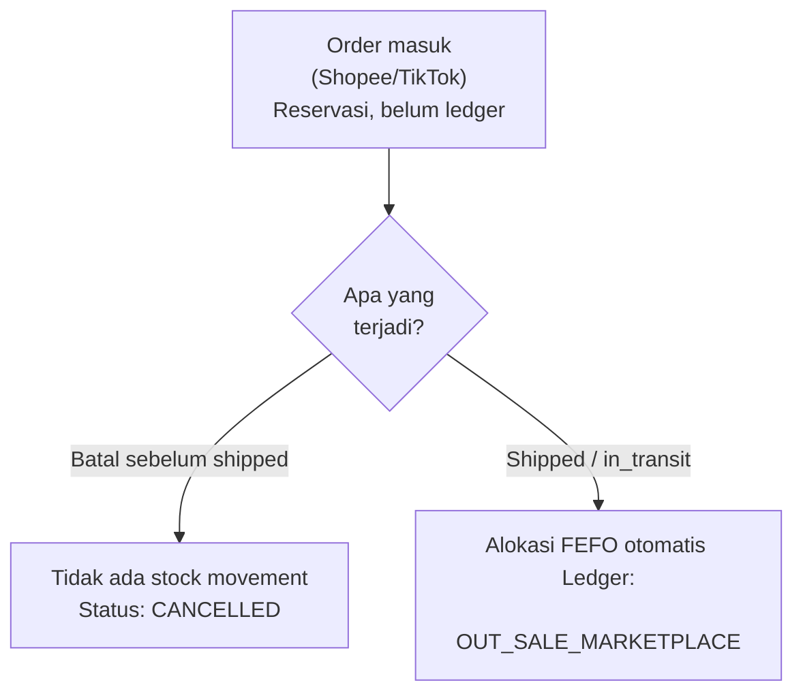
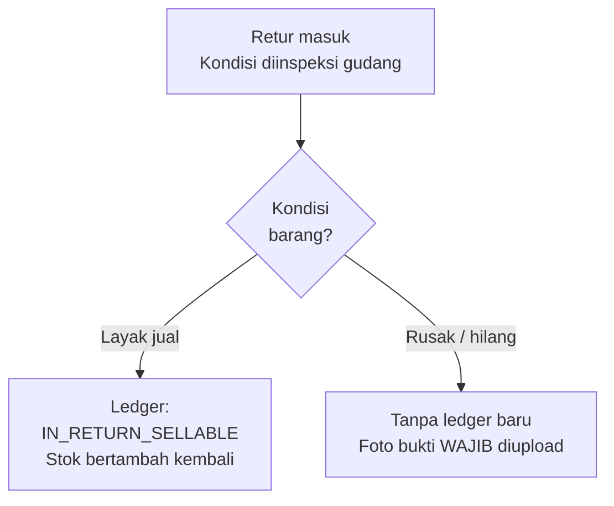
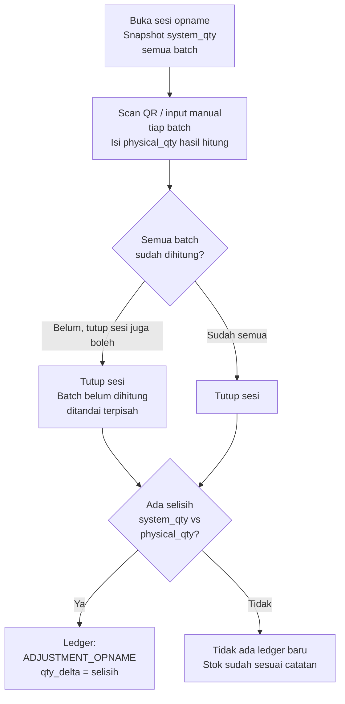

# Sistem Rekonsiliasi Stok — Brand Skincare Indonesia

Aplikasi rekonsiliasi stok mandiri untuk brand skincare Indonesia (~70 produk) yang berjualan lewat Shopee dan TikTok Shop. Dibangun untuk operator gudang yang perlu tahu **kenapa** angka stok di sistem berbeda dari barang fisik di gudang — bukan cuma sekadar tahu ada selisih.

## Problem yang Diselesaikan

Pencatatan stok brand ini sebelumnya manual berbasis spreadsheet, dan hampir tidak pernah cocok dengan barang fisik di gudang. Tidak ada yang bisa menjawab dari mana selisihnya bocor. Sumber kebocoran yang teridentifikasi:

- **Pesanan batal** — barang sudah tercatat keluar, tapi stok tidak pernah dikembalikan di catatan.
- **Retur dengan berbagai nasib** — ada yang kembali layak jual, ada yang rusak, ada yang hilang di ekspedisi.
- **Bonus, promo, dan sampel** — barang keluar gudang tanpa terhubung ke pesanan mana pun, jadi tidak terlihat sebagai apa-apa. Sumber selisih terbesar.
- **Stok awal yang masih perkiraan** — selisih sudah terbentuk bahkan sebelum barang dijual.

Sistem ini menjawabnya lewat satu prinsip inti: **tidak ada angka stok yang berubah tanpa jejak**. Semua pergerakan barang tercatat lewat satu Stock Ledger append-only, sehingga setiap selisih bisa ditelusuri sampai ketahuan sumbernya.

## Fitur Utama

- **Produk & Batch** — data produk (reguler & bundle) dengan resep komposisi, batch dengan tanggal kedaluwarsa, label QR per batch untuk scan gudang.
- **Stock Ledger & Rekonsiliasi** — buku besar pergerakan stok, drilldown per produk, deteksi anomali harian.
- **Barang Masuk Maklon** — pencatatan penerimaan barang dari pabrik maklon.
- **Keluar Manual** — pencatatan barang keluar di luar pesanan (penjualan offline, bonus, promo, sampel, rusak, kedaluwarsa), dengan alokasi batch otomatis (FEFO).
- **Simulasi Marketplace** — tombol simulasi pesanan (baru, kirim, batal, retur) sebagai pengganti integrasi API Shopee/TikTok asli, plus jalur impor CSV.
- **Retur** — inspeksi kondisi barang retur (layak jual / rusak / hilang) dengan bukti foto wajib untuk kondisi rusak/hilang.
- **Stok Opname** — sesi hitung fisik dengan scan QR, otomatis membandingkan dengan catatan sistem dan menulis koreksi ke ledger.
- **Notifikasi** — peringatan batch mendekati kedaluwarsa, dan pengingat klaim TikTok sebelum batas 40 hari.
- **Panduan Penggunaan** — halaman bantuan dalam aplikasi untuk operator gudang.

## Demo

- **Live URL:** https://stok-rekonsiliasi-skincare.vercel.app
- **Kredensial testing:**
  - Email: `admin@gmail.com`
  - Password: `admin123`

<!-- TODO: tambahkan screenshot halaman Produk & Batch, Ledger, dan Stok Opname di sini setelah upload gambar ke repo (folder docs/screenshots/), contoh:

-->

## Alur Proses Bisnis Utama (Workflow)

Dokumen ini menjelaskan alur bisnis inti sistem lewat diagram. Untuk detail panduan operator, lihat [`PANDUAN_PENGGUNA.md`](./PANDUAN_PENGGUNA.md).

### Flow 1 — Kapan Stok Benar-Benar Berkurang

Prinsip dari brief: order masuk hanyalah **reservasi**, bukan pergerakan stok. Stok baru benar-benar terpotong saat barang secara fisik meninggalkan gudang — titik ini beda tiap channel (Shopee saat `SHIPPED`, TikTok saat `IN_TRANSIT`).



**Kenapa dibedakan begini:** kalau order batal sebelum shipped, stok memang belum pernah tersentuh — jadi tidak ada apa pun yang perlu "dikembalikan" ke ledger. Ini mencegah bug klasik: menulis ledger keluar untuk reservasi yang batal, lalu bingung kenapa stok kurang padahal barang tidak pernah keluar gudang.

### Flow 2 — Retur, Kondisi Barang

Kondisi retur diputuskan manual oleh gudang setelah barang fisik diinspeksi — bukan otomatis dari marketplace, karena hanya gudang yang bisa memastikan kondisi barang yang benar-benar diterima.



**Kenapa kondisi Rusak/Hilang tidak menulis ledger baru:** stok untuk barang ini sudah terpotong sejak awal pengiriman (lihat Flow 1). Menulis ledger keluar lagi di titik ini akan menghitung barang yang sama dua kali sebagai kerugian (*double-count*). Foto wajib berfungsi sebagai bukti audit — kenapa barang ini tidak kembali ke stok jual.

### Flow 3 — Stok Opname (Rekonsiliasi Fisik)



**Kenapa sesi tetap bisa ditutup walau ada batch belum dihitung:** operasional gudang sering tidak sempat menghitung 100% batch dalam satu sesi. Sistem tidak memaksa — batch yang belum dihitung tetap tercatat statusnya (bukan diam-diam diabaikan), sehingga terlihat jelas mana yang perlu opname susulan.

## Dokumentasi & Referensi

- [Panduan Pengguna (`PANDUAN_PENGGUNA.md`)](./PANDUAN_PENGGUNA.md) — Dokumentasi fitur lengkap dan tata cara pemakaian aplikasi untuk *end-user* / operator.
- [Skema Database Supabase (`migrations/`)](./migrations/) — *Snapshot* statis berisi *script SQL* untuk nge-*build* ulang *database*, lengkap dengan *View*, *Function/RPC*, *Trigger*, dan RLS.

## Tech Stack

| Teknologi | Alasan Pemilihan |
|---|---|
| **Next.js (App Router) + TypeScript strict** | Sesuai stack wajib brief; App Router memisahkan server/client component dengan jelas, cocok untuk halaman yang butuh data fresh (dashboard stok) sekaligus interaktivitas tinggi (form, scan QR). |
| **Supabase (Postgres)** | Database terkelola dengan Row Level Security bawaan — dipakai langsung untuk mengunci prinsip *append-only* di tabel `stock_ledger` dan `bundle_recipes` (tidak ada policy UPDATE/DELETE untuk role biasa), bukan cuma konvensi di level aplikasi. |
| **RPC Postgres function untuk semua write ledger** | Operasi baca-stok-lalu-tulis-ledger (alokasi FEFO, keluar manual, tutup opname) butuh atomicity — dilakukan lewat `plpgsql` function, bukan beberapa query terpisah dari API route, supaya aman dari race condition saat simulasi berjalan cepat/bersamaan. |
| **shadcn/ui + Tailwind CSS** | Komponen UI konsisten dan cepat dikembangkan, penting untuk aplikasi dengan banyak form dan tabel. |
| **react-hook-form + Zod** | Validasi form konsisten di sisi client, skema Zod yang sama juga dipakai untuk validasi di API route (satu sumber kebenaran untuk aturan input). |
| **SWR** | Data fetching dengan revalidasi otomatis, cocok untuk dashboard yang datanya sering berubah antar modul (stok berubah di satu halaman harus tercermin saat pindah ke halaman lain). |
| **html5-qrcode + qrcode** | Scan QR lewat kamera perangkat (tanpa hardware scanner khusus) untuk Stok Opname, dan generate QR label batch untuk dicetak dan ditempel di gudang. |

## Cara Install & Run

### 1. Clone & install dependencies
```bash
git clone https://github.com/damosfxa/stok-rekonsiliasi-skincare.git
cd stok-rekonsiliasi-skincare
npm install
```

### 2. Setup environment variable
Buat file `.env.local` di root project, isi dengan kredensial project Supabase kamu:
```
NEXT_PUBLIC_SUPABASE_URL=https://xxxxxxxxxxxx.supabase.co
NEXT_PUBLIC_SUPABASE_ANON_KEY=xxxxxxxxxxxxxxxxxxxxxxxxxxxxxxxxxxxxx
```

### 3. Setup database
Jalankan file SQL di folder [`migrations/`](./migrations/) secara berurutan lewat Supabase SQL Editor (project Supabase baru/kosong). Urutan dan penjelasan lengkap ada di [`migrations/README.md`](./migrations/README.md).

### 4. Jalankan aplikasi

| Command | Deskripsi |
|---|---|
| `npm run dev` | Jalankan development server di `http://localhost:3000` |
| `npm run build` | Build production |
| `npm run start` | Jalankan hasil build production |
| `npm run lint` | Cek linting |

### 5. Login
Gunakan kredensial testing di bagian [Demo](#demo) di atas.