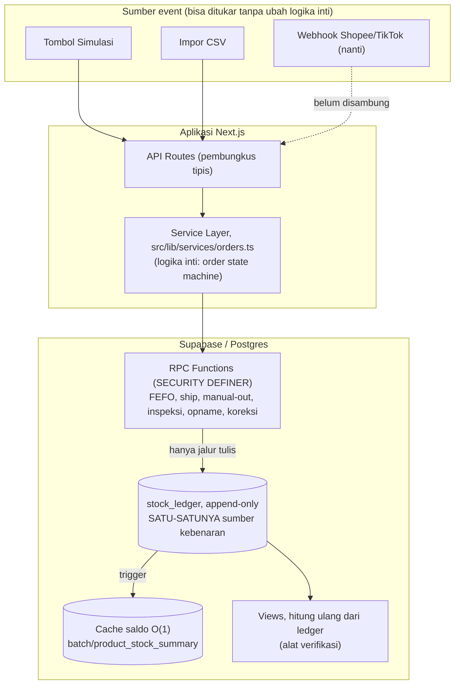
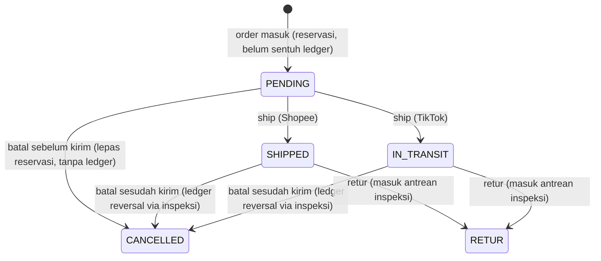
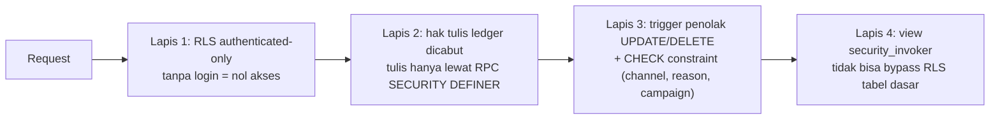

# Arsitektur, Sistem Rekonsiliasi Stok (Celo Beaute)

Dokumen ini menjelaskan keputusan arsitektur utama beserta alasannya. Fokusnya "kenapa", bukan cuma "apa". Untuk struktur tabel lihat `database-schema.md`, untuk alur bisnis lihat `workflow.md`.

## Prinsip yang menaungi semua

**Tidak ada angka stok yang berubah tanpa jejak.** Konsekuensinya, seluruh desain berputar di satu tabel `stock_ledger` yang append-only sebagai satu-satunya sumber kebenaran. Saldo bukan angka yang disimpan lalu diedit, melainkan hasil agregasi dari ledger. Ini yang membuat setiap selisih selalu bisa ditelusuri sampai pergerakan pembentuknya.

## Lapisan sistem



Inti keputusannya: **sumber event (tombol/CSV/webhook) berada di lapisan terluar dan bisa ditukar tanpa menyentuh logika inti.** Detailnya di bagian "Kesiapan webhook" di bawah.

## 1. Ledger append-only + immutability dikunci di level database

Yang dijamin: sekali baris ledger tercatat, tidak bisa diubah atau dihapus siapa pun, termasuk admin, bahkan lewat REST API Supabase langsung.

Kenapa di level DB, bukan cuma aturan aplikasi: aturan di kode aplikasi bisa dilewati (mis. akses langsung ke REST API Supabase pakai anon key yang memang publik). Immutability yang benar harus ditegakkan di database.

Cara penegakannya berlapis:
- Hak `INSERT/UPDATE/DELETE` ke `stock_ledger` dari role aplikasi (`authenticated`/`anon`) dicabut (`REVOKE`, migration `0124`).
- Trigger `trg_block_ledger_update` / `trg_block_ledger_delete` menolak UPDATE/DELETE untuk jalur yang tidak tunduk GRANT/RLS (service_role, SQL Editor).
- Satu-satunya jalur tulis: 7 RPC function `SECURITY DEFINER` (migration `0123`), yang masing-masing memvalidasi aturan bisnisnya sendiri (FEFO, wajib catatan, wajib referensi campaign, wajib foto write-off) sebelum menulis.

Koreksi apa pun selalu berupa entri BARU (`ADJUSTMENT_OPNAME` / `ADJUSTMENT_CORRECTION` / reversal), tidak pernah edit baris lama. Jejak tetap utuh.

## 2. Order state machine



Poin penting: **stok baru terpotong saat SHIPPED/IN_TRANSIT**, bukan saat order masuk. Sebelum itu murni reservasi. Batal sebelum kirim tidak menyentuh ledger; batal sesudah kirim jadi reversal lewat jalur inspeksi (sama seperti retur), dan kondisi barangnya diputuskan gudang manual.

## 3. Alokasi FEFO otomatis

Saat barang keluar (ship atau keluar manual), sistem memilih batch dengan tanggal kedaluwarsa terdekat lebih dulu (First Expired, First Out), lewat `fn_allocate_fefo`. Operator tidak pernah memilih batch manual. Satu order bisa terpecah ke beberapa batch kalau qty melebihi stok satu batch, tercatat di `order_item_batch_allocations`.

## 4. Bundle dipecah ke satuan (resep di-versioning)

Bundle tidak punya stok sendiri. Saat order bundle masuk, komposisinya dipecah ke produk satuan lewat resep admin, lalu yang masuk ledger adalah komponen satuannya. Resep di-versioning (`bundle_recipes.version`/`is_active`): mengedit resep membuat versi baru, order lama yang sudah terjadi tetap memakai komposisi saat itu, tidak ikut berubah.

## 5. Baca saldo O(1) via cache, tetap bisa diverifikasi

Ledger akan tumbuh jutaan baris. Menjumlah ulang seluruh ledger tiap kali butuh saldo (`SUM ... GROUP BY`) akan makin lambat, dan jalur terpanasnya adalah `fn_allocate_fefo` (dipanggil tiap barang keluar). Solusinya: tabel cache `batch_stock_summary` / `product_stock_summary` yang di-maintain otomatis oleh trigger tiap ada baris ledger baru, jadi baca saldo O(1).

Kunci keamanannya: cache **bukan** sumber kebenaran. View `v_batch_stock` / `v_product_stock` tetap menghitung langsung dari ledger dan berfungsi sebagai alat verifikasi independen, saldo selalu bisa dicocokkan ulang ke ledger kapan saja (lihat `migrations/diagnostic-verify-stock-summary-cache-*.sql`).

## 6. Kesiapan webhook asli (lapisan import = adapter)

Tombol simulasi dan impor CSV **sama-sama memanggil fungsi service layer yang sama** (`createOrderWithItems`, `shipOrderItems`, `cancelOrder`, `createReturnRequest` di `src/lib/services/orders.ts`). API route-nya cuma pembungkus tipis: parse input, panggil fungsi service. Logika inti tidak tahu-menahu dari mana event berasal.

Artinya menyambung webhook Shopee/TikTok asli nanti tidak menyentuh logika inti sama sekali, cukup menambah satu route yang menerjemahkan payload webhook lalu memanggil fungsi service yang sama. Contoh ilustratif (belum diaktifkan, karena brief memang belum meminta integrasi API asli):

```ts
// contoh: app/api/webhooks/shopee/route.ts (ilustrasi kesiapan, belum aktif)
import { createOrderWithItems, shipOrderItems } from "@/lib/services/orders";
import { createServiceClient } from "@/lib/supabase/service";

export async function POST(request: Request) {
  const event = await request.json(); // payload webhook Shopee asli
  const supabase = createServiceClient();

  // Terjemahkan bentuk payload webhook ke argumen service yang SUDAH ADA.
  // Tidak ada logika stok/FEFO/ledger baru di sini, semua tetap di service layer.
  if (event.type === "order.create") {
    await createOrderWithItems(supabase, {
      channel: "shopee",
      externalOrderId: event.order_sn,
      items: event.items.map((i) => ({ sku: i.item_sku, qty: i.quantity })),
      orderedAt: event.create_time,
    });
  } else if (event.type === "order.shipped") {
    // cari order_item dari external id, lalu shipOrderItems(...)
  }
  return Response.json({ ok: true });
}
```

Idempotency sudah dijamin di level database lewat unique constraint `orders(channel, external_order_id)`, jadi webhook yang mengirim ulang event yang sama (hal biasa di webhook asli) tidak akan membuat data duplikat, ditangani di `createOrderWithItems` yang menangkap error kode `23505`.

## 7. Keamanan berlapis



- RLS aktif di semua tabel, seluruh policy dibatasi ke role `authenticated` (migration `0121` + `0126`). Publik/anon ditolak total.
- Fungsi `SECURITY DEFINER` diberi `SET search_path` (cegah pembajakan search_path).
- View pakai `security_invoker = true` (migration `0122`) supaya tidak bypass RLS tabel dasarnya.
- Storage bucket foto retur: upload dibatasi `authenticated`, tanpa policy UPDATE/DELETE.
- Diverifikasi langsung ke database live lewat `migrations/diagnostic-security-audit-*.sql`, bukan sekadar percaya file migration (drift bisa terjadi).

## Ringkasan keputusan & alasan

| Keputusan | Alasan |
|---|---|
| Ledger append-only sebagai sumber kebenaran | Setiap selisih bisa ditelusuri, tidak ada perubahan tanpa jejak |
| Immutability dikunci di DB (REVOKE + trigger + RPC) | Aturan aplikasi bisa dilewati lewat REST API; DB tidak |
| Stok terpotong saat SHIPPED/IN_TRANSIT | Barang dihitung keluar saat fisik keluar gudang, bukan saat order masuk |
| FEFO otomatis | Kurangi risiko barang kedaluwarsa, hilangkan kesalahan pilih batch manual |
| Bundle dipecah satuan + resep versioning | Tidak ada stok bundle; order lama konsisten walau resep berubah |
| Cache saldo O(1) + view verifikasi | Cepat untuk ledger jutaan baris, tapi tetap bisa dibuktikan benar |
| Lapisan import = adapter di belakang service | Ganti ke webhook asli tanpa sentuh logika inti |
| Keamanan berlapis di level DB | Data tetap aman walau lapisan aplikasi ditembus |
