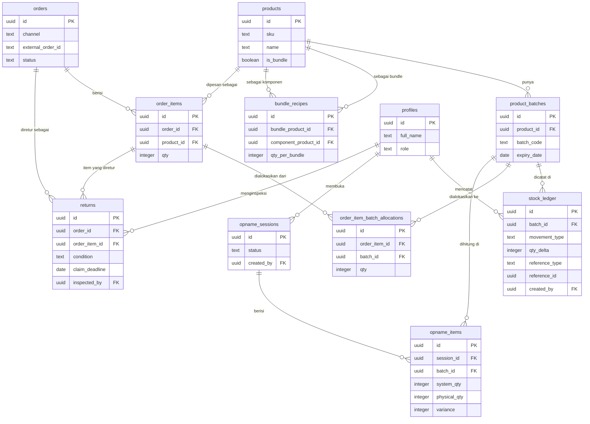

# Database Schema

Skema database Postgres (Supabase) untuk sistem rekonsiliasi stok. File SQL lengkap dan siap dijalankan ada di folder `migrations/`.

## ER Diagram

*(`profiles.id` juga mereferensikan `auth.users.id` milik Supabase Auth — tidak digambar di atas karena tabel itu ada di schema `auth`, bukan `public`.)*

## Tabel Inti

| Tabel | Fungsi |
|---|---|
| `products` | Master data produk. `is_bundle` menentukan apakah produk ini paket gabungan. |
| `product_batches` | Batch fisik per produk, punya tanggal kedaluwarsa sendiri-sendiri. |
| `bundle_recipes` | Resep komposisi bundle — 1 baris per komponen penyusun. |
| `stock_ledger` | **Satu-satunya sumber kebenaran stok.** Append-only, lihat `SECURITY.md`. |
| `orders` / `order_items` | Pesanan dari marketplace (atau simulasi/impor CSV). |
| `order_item_batch_allocations` | Hasil alokasi FEFO — 1 order_item bisa kepecah ke beberapa batch. |
| `returns` | Pengajuan retur dan hasil inspeksi kondisinya. |
| `opname_sessions` / `opname_items` | Sesi hitung stok fisik dan hasil per batch. |
| `profiles` | Profil user, dibuat otomatis saat signup lewat Supabase Auth. |

## Views (Turunan, Bukan Tabel Fisik)

Semua angka stok yang ditampilkan ke user berasal dari view ini, dihitung ulang setiap kali di-query — bukan angka yang disimpan statis.

| View | Fungsi |
|---|---|
| `v_batch_stock` | Stok saat ini per batch (`sum(qty_delta)` dari `stock_ledger`). |
| `v_product_stock` | Stok saat ini per produk (jumlah semua batch milik produk itu). |
| `v_expiring_batches` | Batch dengan sisa waktu ≤ 90 hari sebelum kedaluwarsa dan masih ada stok. |
| `v_pending_tiktok_claims` | Retur TikTok yang klaim ke platform-nya belum diajukan. |
| `v_daily_anomalies` | Deteksi order `CANCELLED` yang ternyata masih punya ledger keluar — kejanggalan self-consistency. |

## Alasan Desain Kunci

- **UUID sebagai primary key di semua tabel** — supaya ID bisa digenerate di sisi manapun (client atau server) tanpa perlu roundtrip ke database dulu, dan tidak menebak-nebak urutan data (beda dari auto-increment integer).
- **`stock_ledger.reference_type` + `reference_id` generik** (bukan foreign key literal ke banyak tabel) — satu baris ledger bisa merujuk ke `order`, `return`, atau `opname_session` tanpa perlu kolom FK terpisah untuk tiap kemungkinan sumber.
- **Tidak ada kolom "current_qty" tersimpan di tabel `products` atau `product_batches`** — sengaja dihindari, supaya tidak ada kemungkinan angka itu "lupa disinkronkan" dengan ledger aslinya. Satu-satunya cara tahu stok adalah menghitung ulang dari `stock_ledger` lewat view.