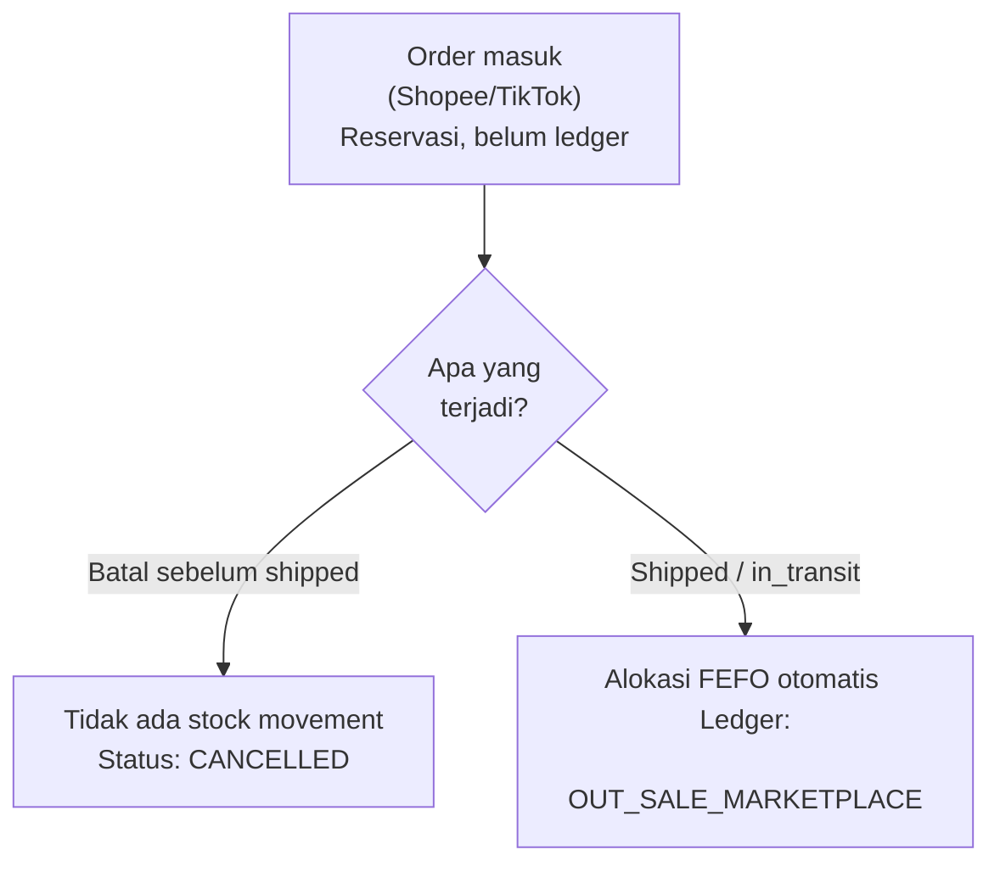
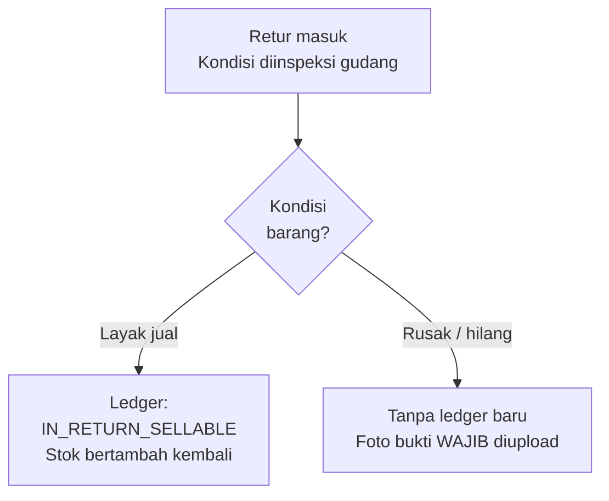
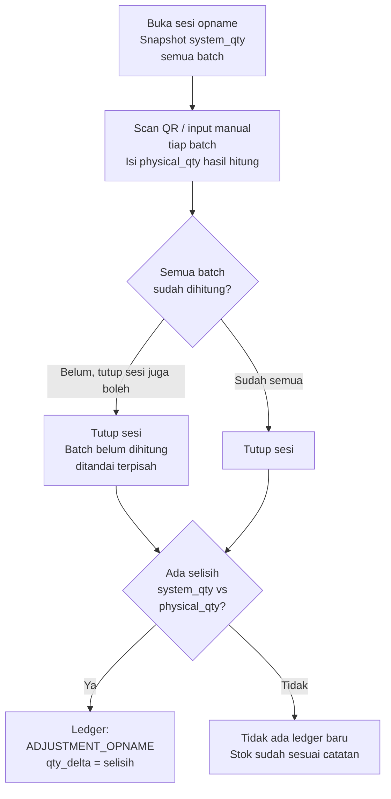

# Workflow — Alur Proses Bisnis Utama

Dokumen ini menjelaskan alur bisnis inti sistem lewat diagram. Untuk detail panduan operator, lihat [`PANDUAN_PENGGUNA.md`](./PANDUAN_PENGGUNA.md).

### Flow 1 — Kapan Stok Benar-Benar Berkurang

Prinsip dari brief: order masuk hanyalah **reservasi**, bukan pergerakan stok. Stok baru benar-benar terpotong saat barang secara fisik meninggalkan gudang — titik ini beda tiap channel (Shopee saat `SHIPPED`, TikTok saat `IN_TRANSIT`).

**Kenapa dibedakan begini:** kalau order batal sebelum shipped, stok memang belum pernah tersentuh — jadi tidak ada apa pun yang perlu "dikembalikan" ke ledger. Ini mencegah bug klasik: menulis ledger keluar untuk reservasi yang batal, lalu bingung kenapa stok kurang padahal barang tidak pernah keluar gudang.

### Flow 2 — Retur, Kondisi Barang

Kondisi retur diputuskan manual oleh gudang setelah barang fisik diinspeksi — bukan otomatis dari marketplace, karena hanya gudang yang bisa memastikan kondisi barang yang benar-benar diterima.

**Kenapa kondisi Rusak/Hilang tidak menulis ledger baru:** stok untuk barang ini sudah terpotong sejak awal pengiriman (lihat Flow 1). Menulis ledger keluar lagi di titik ini akan menghitung barang yang sama dua kali sebagai kerugian (*double-count*). Foto wajib berfungsi sebagai bukti audit — kenapa barang ini tidak kembali ke stok jual.

### Flow 3 — Stok Opname (Rekonsiliasi Fisik)

**Kenapa sesi tetap bisa ditutup walau ada batch belum dihitung:** operasional gudang sering tidak sempat menghitung 100% batch dalam satu sesi. Sistem tidak memaksa — batch yang belum dihitung tetap tercatat statusnya (bukan diam-diam diabaikan), sehingga terlihat jelas mana yang perlu opname susulan.
